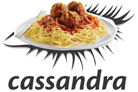

# Lasagna
Lasagna db, because everything else is so much spaghetti.

## Requirements
* Scailable Distributed Db solution
* Keyed Partitions
* Sorted Rows in Partitions
* Auto Cluster
* Auto Managment

Basicly Fire and Forget.

## Why

For Jokes!
